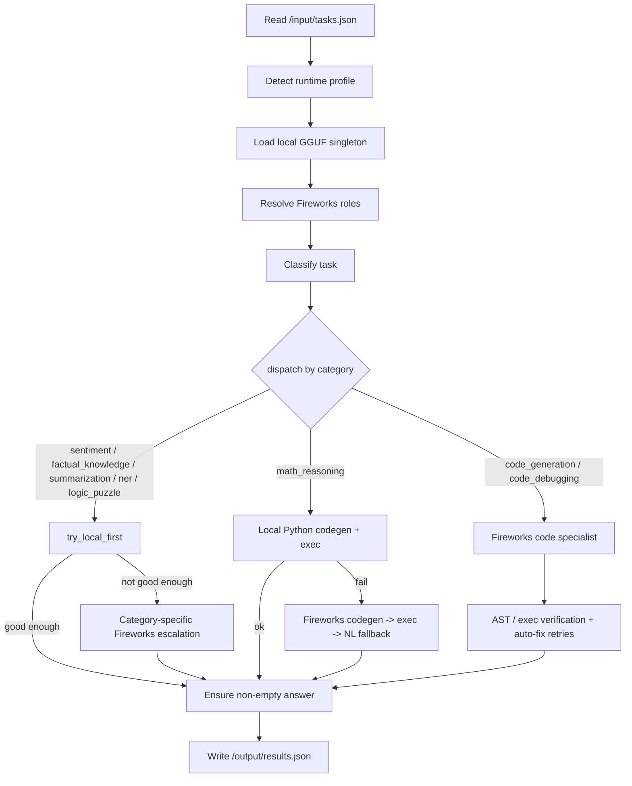

# Architecture

## Overview

This repository implements a single-run Track 1 agent that reads `/input/tasks.json`, solves each task, and writes `/output/results.json`.

The system is a hybrid router: cheap categories are answered by a bundled local GGUF model first, escalating to Fireworks only when the local answer isn't good enough; a few categories go straight to Fireworks because a small local model can't do them reliably. Every path guarantees a non-empty answer.

Code is organized into three layers so parameters, prompts, and business logic never live in the same place:

- **`config.py`** — every tunable number: timeouts, per-category token budgets, and the Fireworks role-routing tables.
- **`categories/prompts.py`** — every literal string sent to a model (local or Fireworks), keyed by category.
- **`categories/handlers/*.py`** — the actual per-category decision logic, reading from the two files above instead of owning literals.

## End-to-End Flow

1. `main.py` loads the task list from `/input/tasks.json`.
2. `categories/executor.py` detects the runtime profile (`docker` / `amd_notebook` / `local`) and picks worker counts and llama.cpp settings.
3. `categories/local_model.py` loads the bundled GGUF model once as a singleton (`get_local_model()`).
4. `categories/routing.py` resolves each Fireworks role to a concrete model ID by health-probing the `ALLOWED_MODELS` candidates once at startup.
5. For each task, `categories/classifier.py` assigns one of the 8 fixed categories (`categories/task_categories.py`).
6. `categories/handlers/__init__.py::dispatch()` routes the task to the matching handler module.
7. `categories/metrics.py` records latency and token usage for every model call.
8. `main.py` writes the final `{task_id, answer}` list to `/output/results.json`.

## Category Routing Map

| Category | Local-first? | Fireworks role (`config.CATEGORY_ROLE`) | Handler |
|---|---|---|---|
| `sentiment` | yes | `cheap_general` | `categories/handlers/sentiment.py` |
| `factual_knowledge` | yes | `cheap_general` | `categories/handlers/factual.py` |
| `summarization` | yes | `summarization` (dedicated cascade) | `categories/handlers/summarization.py` |
| `ner` | yes | `ner_general` | `categories/handlers/ner.py` |
| `logic_puzzle` | yes | `reasoning_specialist` | `categories/handlers/logic.py` |
| `math_reasoning` | yes (local Python exec) | `code_specialist` (fallback only) | `categories/handlers/math_reasoning.py` |
| `code_generation` | no | `code_specialist` | `categories/handlers/code_verify.py` |
| `code_debugging` | no | `code_specialist` | `categories/handlers/code_verify.py` |

If `classify()` ever returned something outside these 8 categories, `categories/handlers/general.py` is the dispatch fallback — a defensive safety net, not a path any real task should take.

Role → model resolution happens once per run in `categories/routing.py::resolve_roles()`: each role has an ordered list of candidate-model keyword tiers (`config.ROLE_CANDIDATE_TIERS`); the first tier whose model responds to a live health probe wins for the whole run.

## Category Pipelines

### Sentiment, factual knowledge, summarization, NER, logic puzzles

All five follow the same shape, implemented once as `categories/handlers/base.py::try_local_first()`:

1. If the local model is loaded, run it with an 8s timeout.
2. Check the answer against a category-specific "is this good enough" gate (e.g. `factual.py::_factual_answer_is_confident`, `logic.py::_logic_answer_is_confident`, a minimum word count for summarization, JSON-array validity for NER).
3. If it passes, log it as a local call and return immediately (zero Fireworks tokens).
4. Otherwise escalate: `sentiment.py` and `summarization.py` have their own multi-tier Fireworks retry logic; `factual.py`, `ner.py`, and `logic.py` fall through to `categories/normalizer.py::normalize_prompt()` + `categories/routing.py::route()` and retry once via `base.py::recover_empty_answer()` if the first Fireworks call comes back empty.

### Math reasoning

- `categories/handlers/math_reasoning.py::_solve_math()` first asks the local model for a short Python script (`run_math_code`), executes it in a sandboxed subprocess (`categories/code_exec.py::run_code_safely`), and injects a missing `print()` if the model forgot one.
- If local execution fails, it asks Fireworks for a script instead, retries once with the error message on failure, and falls back to a terse natural-language numeric answer as a last resort.
- If the prompt asks for an explanation, one is generated (locally if possible, otherwise via Fireworks) and appended around the numeric answer.

### Code generation / debugging

- `categories/handlers/code_verify.py::_solve_via_code_verify()` calls the Fireworks code specialist, retries once with a stricter prompt if the output looks truncated (no code fence, or a fence with no real function body), then hands the result to `categories/code_verifier.py::verify_and_fix()`.
- `verify_and_fix()` AST-parses the code and, for `code_generation`, actually calls every top-level function with generic smoke-test arguments (`categories/code_exec.py::run_code_generation_check`) rather than just checking that the script ran. It retries the fix up to twice before falling back to a plain natural-language answer.

## Module Reference

| Module | Responsibility |
|---|---|
| `main.py` | Entrypoint: load tasks, build the Fireworks client + local model, dispatch each task, write results. No business logic. |
| `config.py` | Timeouts, per-category token budgets, Fireworks role-routing tables. |
| `categories/task_categories.py` | The 8 category name constants and category-set groupings — single source of truth so a typo becomes an import error, not a silent misroute. |
| `categories/prompts.py` | Every literal prompt string, one constant/dict per category or module. |
| `categories/classifier.py` | Regex scoring + optional local-model tie-break, with an NER plausibility guard. |
| `categories/normalizer.py` | Strips conversational fluff, wraps the category instruction from `prompts.py`, and enforces mechanical summarization constraints (exact word/bullet counts). |
| `categories/routing.py` | Resolves each Fireworks role to a concrete, health-checked model ID. |
| `categories/local_model.py` | Owns the GGUF singleton; exposes `run_sentiment`, `run_factual`, `run_summarization`, `run_ner`, `run_logic`, `run_math_code`, `run_math_explanation`. |
| `categories/code_exec.py` | Extracts code from model output; runs it in a sandboxed subprocess; smoke-tests `code_generation` output by calling its functions. |
| `categories/code_verifier.py` | AST/exec verification and the auto-fix retry loop for code tasks. |
| `categories/prompt_compressor.py` | Pure-Python TF-IDF-style sentence compression for long prompts (no ML dependency). |
| `categories/metrics.py` | Per-task latency/token logging and the run summary report. |
| `categories/executor.py` | Detects the runtime profile (docker / amd_notebook / local) and derives thread counts / llama.cpp settings from it. |
| `categories/handlers/` | One module per category (`handle(task, category, ctx) -> {"task_id", "answer"}`) plus `base.py` (shared local-first/fallback helpers) and `context.py` (`PipelineContext`). |
| `utils/fireworks_client.py` | OpenAI-compatible Fireworks client wrapper; streams responses and records token/latency metrics. |

## Packaging and Runtime

The Docker image bundles the local model files under `/app/models/`. The Dockerfile sets:

- `EVAL_ENV=docker`
- `LOCAL_MODEL_PATH=/app/models/qwen2.5-3b-instruct-q4_k_m.gguf`
- `LOCAL_MODEL_FALLBACK_PATH=/app/models/smollm2-1.7b-instruct-q4_k_m.gguf`

The evaluation harness injects `FIREWORKS_API_KEY`, `FIREWORKS_BASE_URL`, and `ALLOWED_MODELS` at runtime — never hardcoded.

## Testing

- `tests/unit/` — pure-logic pytest tests (classifier scoring, prompt normalization, code extraction, compression, category-table consistency).
- `tests/golden/` — runs the real `main.run_pipeline()` against a fixed task set with an in-memory fake Fireworks client (`tests/golden/fake_client.py`), asserting every category still produces a well-formed answer. This is the regression harness for structural changes.
- `tests/run_fireworks_pipeline.py` — real-API smoke runner against `input/tasks.json`; requires `FIREWORKS_API_KEY` / `FIREWORKS_BASE_URL` / `ALLOWED_MODELS`, spends real tokens.
- `tests/check_model_availability.py` — manual dev script that probes each Fireworks model ID; not pytest-collected because it makes billed API calls at import time.

Run `pytest` from the repo root for the free/local suite.

## Reliability and Cost Strategy

1. Prefer local inference for every category where a small model can plausibly do the job (sentiment, factual knowledge, summarization, NER, logic puzzles, math).
2. Escalate to Fireworks only when the local answer fails an explicit confidence/validity gate, never unconditionally.
3. Guarantee a non-empty answer for every task via `categories/handlers/base.py::ensure_nonempty_answer()`, which has a category-specific last-resort fallback.
4. Verify structured/code outputs locally (AST parse, sandboxed execution, JSON validation) instead of trusting the model's first answer.

## Diagram

