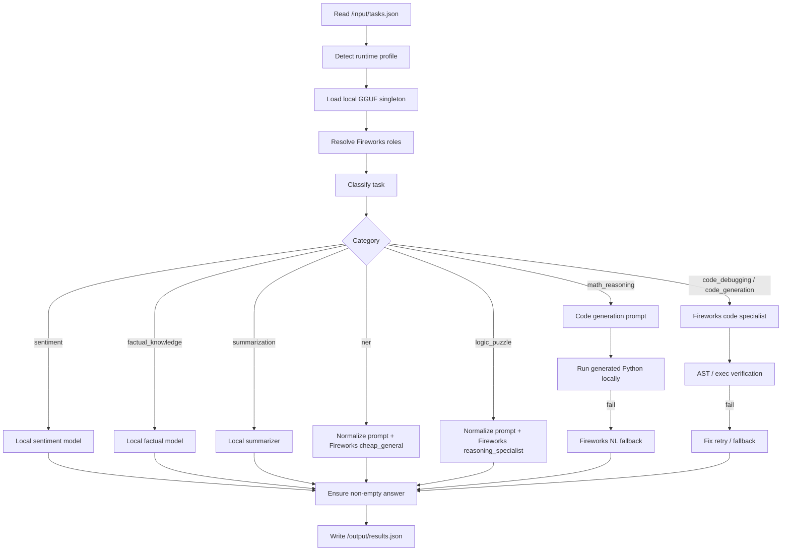
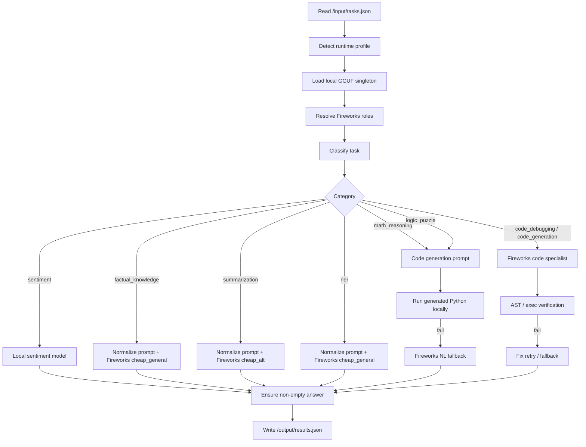
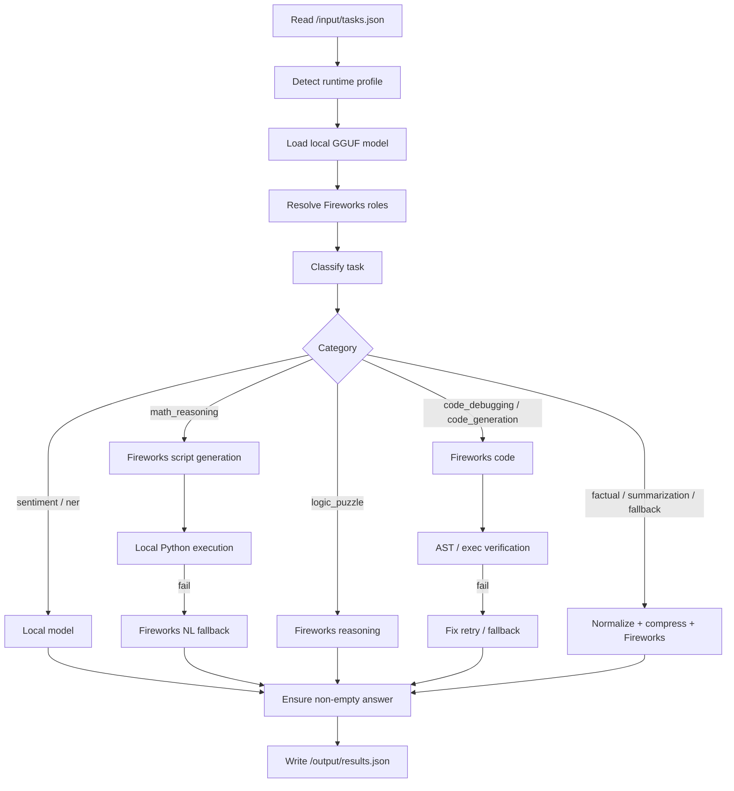

# Current Architecture

## Overview

This repository implements a single-run Track 1 agent that reads `/input/tasks.json`, solves each task, and writes `/output/results.json`.

The system is a hybrid router with three execution styles:

- local GGUF inference for cheap categories
- Fireworks inference for categories that need remote model access
- local Python execution for math reasoning, with Fireworks fallback when needed

Every path is wrapped in prompt shaping, retries, and a non-empty final fallback so the pipeline can always write a result.

## End-to-End Flow

1. `main.py` loads the task list from JSON.
2. `categories.executor.py` detects the runtime profile and chooses worker counts and llama.cpp settings.
3. `categories.local_model.py` loads the bundled GGUF model once as a singleton.
4. `categories.routing.py` resolves Fireworks roles against the allowed model list and health-probes the candidates.
5. `categories.classifier.py` assigns each raw prompt to one of the fixed task categories.
6. `main.py` sends the task through the category-specific path.
7. `categories.metrics.py` records latency and token usage.
8. `main.py` writes the final list of `{task_id, answer}` objects to `/output/results.json`.

## Exact Routing Map

### Local model categories

These categories use the bundled local GGUF model first:

- `sentiment` → local Qwen2.5-1.5B
- `factual_knowledge` → local Qwen2.5-1.5B
- `summarization` → local Qwen2.5-1.5B, with Fireworks fallback if the local result looks off

### Fireworks categories

These categories are routed through Fireworks via `categories/routing.py`:

- `ner` → `cheap_general`
- `logic_puzzle` → `reasoning_specialist`
- `code_debugging` → `code_specialist`
- `code_generation` → `code_specialist`

Role resolution currently maps those roles to the first healthy allowed Fireworks model matching the tier:

- `cheap_general` → first healthy match of `gemma-4-26b-a4b-it` or `minimax-m3`
- `cheap_alt` → first healthy match of `gemma-4-31b-it-nvfp4` or `minimax-m3`
- `reasoning_specialist` → first healthy match of `minimax-m3`
- `code_specialist` → first healthy match of `kimi-k2p7-code`

If no candidate in a role’s tier is reachable, the system falls back to the first allowed model.

### Math reasoning

- `math_reasoning` uses the code-execution path.
- Fireworks generates a short Python script.
- The script is executed locally in a sandbox.
- If execution fails, the agent falls back to a natural-language Fireworks answer.

## Category Pipelines

### Sentiment

- `main.py` classifies the prompt.
- `run_sentiment()` in `categories/local_model.py` uses the bundled GGUF model.
- The output is a single sentence that starts with `positive`, `negative`, or `neutral` and includes a one-sentence justification.
- The answer is accepted locally and logged as a local call.

### Factual knowledge

- `main.py` normalizes the prompt and routes it to `run_factual()` in `categories/local_model.py`.
- The local prompt asks for 2-3 sentences maximum, with no background context.
- The prompt also asks the model to minimize output tokens while maximizing clarity.
- This path stays local and does not use Fireworks unless the local answer is empty.

### Summarization

- `main.py` normalizes the prompt and routes it to `run_summarization()` in `categories/local_model.py`.
- The prompt tells the model to be as concise and clear as possible and to minimize output tokens.
- The prompt also adds the anti-refusal clause.
- `main.py` accepts the local summary if it looks reasonable; otherwise it falls back to Fireworks.

### NER

- `main.py` normalizes the prompt.
- The prompt is routed to Fireworks using `cheap_general`.
- The NER prompt asks for a simple extraction format: `entity:label,entity:label`.
- The model is instructed to return only entity/label pairs and to avoid markdown or conversational text.

### Logic puzzles

- `main.py` routes logic puzzles to Fireworks reasoning.
- `categories.routing.route("logic_puzzle")` resolves the `reasoning_specialist` role.
- The prompt asks the model to reason through the puzzle and state the final answer clearly.

### Code debugging and code generation

- `main.py` sends these categories through the Fireworks code-specialist path.
- `categories.code_verifier.verify_and_fix()` checks the output with AST parsing and, for code generation, execution.
- If verification fails, the system retries with a stricter fix prompt.
- If it still fails, the agent falls back to a non-empty answer.

## Module Connections

### `main.py`

This is the orchestration layer.

It connects:

- `categories.classifier.classify()` for task classification
- `categories.routing.route()` for Fireworks model selection
- `categories.normalizer.normalize_prompt()` for prompt shaping
- `categories.local_model.run_sentiment()`, `run_factual()`, and `run_summarization()` for local inference
- `categories.code_exec.build_codegen_messages()` and `run_code_safely()` for sandboxed execution
- `categories.code_verifier.verify_and_fix()` for code validation
- `categories.metrics.MetricsCollector` for logging

### `categories/classifier.py`

This module performs category detection using regex heuristics and optional local-model confirmation.

### `categories/local_model.py`

This module owns the bundled GGUF singleton and exposes local helpers for sentiment, factual knowledge, and summarization.

### `categories/normalizer.py`

This module builds category-specific chat prompts and sets the token budgets.

### `categories/routing.py`

This module maps each category to a Fireworks role, probes the candidate models, and returns the resolved model id.

### `categories/code_exec.py`

This module builds math code-generation prompts and executes generated Python in a subprocess.

### `categories/code_verifier.py`

This module verifies and repairs generated code before allowing it to be returned.

### `categories/prompt_compressor.py`

This module reduces long prompts with conservative sentence selection before sending them to Fireworks.

### `categories/metrics.py`

This module collects token counts, request latency, and run summaries.

### `utils/fireworks_client.py`

This module wraps the OpenAI-compatible Fireworks client and streams usage-aware completions.

## Packaging and Runtime

The Docker image bundles the local model files under `/app/models/`.

The Dockerfile sets:

- `EVAL_ENV=docker`
- `LOCAL_MODEL_PATH=/app/models/qwen2.5-1.5b-instruct-q4_k_m.gguf`
- `LOCAL_MODEL_FALLBACK_PATH=/app/models/smollm2-1.7b-instruct-q4_k_m.gguf`

The evaluation harness injects `FIREWORKS_API_KEY`, `FIREWORKS_BASE_URL`, and `ALLOWED_MODELS` at runtime.

## Reliability and Cost Strategy

The architecture is optimized for three goals:

1. Keep cheap categories local where possible.
2. Use Fireworks only for the categories that need it.
3. Prevent empty outputs by applying category-specific fallback behavior.

The token-heavy paths are NER, logic reasoning, and the code branches that need Fireworks completions.

## Diagram

# Current Architecture

## Overview

This repository implements a single-run Track 1 agent that reads `/input/tasks.json`, solves each task, and writes `/output/results.json`.

The architecture is a hybrid pipeline:

- some categories run locally through the bundled GGUF model
- some categories go through Fireworks routing with model-role resolution
- some categories use local Python execution as a verification/sandbox layer
- every path is wrapped in prompt shaping, retries, and non-empty fallback logic

## End-to-End Flow

1. `main.py` loads the task list from JSON.
2. `categories.executor.py` detects the runtime profile and sets worker counts and local-model settings.
3. `categories.local_model.py` loads the bundled GGUF model once as a singleton.
4. `categories.routing.py` resolves Fireworks roles against the allowed model list and health-probes the candidates.
5. `categories.classifier.py` assigns each raw prompt to one of the fixed task categories.
6. `main.py` sends the task down the category-specific path.
7. `categories.metrics.py` records latency and token usage.
8. `main.py` writes the final list of `{task_id, answer}` objects to `/output/results.json`.

## Exact Routing Map

### Local model categories

These categories use the bundled local GGUF model first:

- `sentiment` → local Qwen2.5-1.5B

The local sentiment path is implemented in `categories/local_model.py` via `run_sentiment()`.

### Fireworks categories

These categories are routed through Fireworks via `categories/routing.py`:

- `factual_knowledge` → `cheap_general`
- `summarization` → `cheap_alt`
- `ner` → `cheap_general`
- `code_debugging` → `code_specialist`
- `code_generation` → `code_specialist`
- `math_reasoning` → `code_specialist`
- `logic_puzzle` → `code_specialist`

The role name is resolved at startup to the first healthy allowed Fireworks model matching that tier.

Current role-to-model resolution logic:

- `cheap_general` → first healthy match of `gemma-4-26b-a4b-it` or `minimax-m3`
- `cheap_alt` → first healthy match of `gemma-4-31b-it-nvfp4` or `minimax-m3`
- `quality_general` → first healthy match of `gemma-4-31b-it` or `minimax-m3`
- `code_specialist` → first healthy match of `kimi-k2p7-code`
- `reasoning_specialist` → first healthy match of `minimax-m3`

If no candidate in a role’s tier is reachable, the system falls back to the first allowed model.

## Category Pipelines

### Sentiment

- `main.py` classifies the prompt.
- `run_sentiment()` in `categories/local_model.py` cleans the prompt and returns `positive`, `negative`, or `mixed`.
- The answer is accepted directly and logged as a local call.

### Factual knowledge

- `main.py` normalizes the prompt with `categories.normalizer.normalize_prompt()`.
- The prompt is routed to Fireworks using `cheap_general`.
- `categories.normalizer.get_max_tokens()` caps the request at 150 tokens.
- The factual prompt instructs the model to answer in 2-3 sentences with no background context.

### Summarization

- `main.py` normalizes the prompt.
- The prompt is routed to Fireworks using `cheap_alt`.
- The summarization prompt asks the model to be as concise as possible and strictly minimize output tokens.
- The prompt also tells the model not to apologize or refuse, and to return the closest possible summary if an exact count is hard.
- `main.py` accepts the model output directly and does not perform word-count post-validation.

### NER

- `main.py` normalizes the prompt.
- The prompt is routed to Fireworks using `cheap_general`.
- The NER prompt requires JSON-only output with `text` and `type` keys.
- The model is expected to return an empty JSON array `[]` if no entities are found.

### Math reasoning

- `main.py` sends math tasks to the code-exec path.
- `categories.code_exec.build_codegen_messages()` creates a Python-script prompt.
- Fireworks returns a short script.
- `categories.code_exec.run_code_safely()` executes the script in a sandboxed subprocess.
- If execution fails, `main.py` falls back to a natural-language Fireworks answer.

### Logic puzzles

- `main.py` sends logic puzzles through the same code-execution path as math reasoning.
- `categories.code_exec.py` now treats logic puzzles as code-generation tasks too.
- The system prompt asks the model to solve the puzzle with constraints, permutations, or elimination and print the final answer to stdout.
- If the script path fails, the task falls back through the same recovery logic as math.

### Code debugging and code generation

- `main.py` normalizes the prompt.
- Fireworks generates code through the `code_specialist` role.
- `categories.code_verifier.verify_and_fix()` checks the code with AST parsing and, for code generation, execution.
- If verification fails, the system retries with a fix prompt.
- If it still fails, the agent falls back to a plain text answer.

## Module Connections

### `main.py`

This is the orchestration layer.

It connects:

- `categories.classifier.classify()` for task classification
- `categories.routing.route()` for Fireworks model selection
- `categories.normalizer.normalize_prompt()` for prompt shaping
- `categories.code_exec.build_codegen_messages()` and `run_code_safely()` for sandboxed execution
- `categories.code_verifier.verify_and_fix()` for code validation
- `categories.local_model.run_sentiment()` for local sentiment inference
- `categories.metrics.MetricsCollector` for logging

### `categories/classifier.py`

This module performs category detection using regex heuristics and optional local-model confirmation.

### `categories/local_model.py`

This module owns the bundled GGUF singleton and exposes local helpers such as `run_sentiment()`.

### `categories/normalizer.py`

This module builds the category-specific chat prompts and sets the token budgets.

### `categories/routing.py`

This module maps each category to a Fireworks role, probes the candidate models, and returns the resolved model id.

### `categories/code_exec.py`

This module builds math/logic code-generation prompts and executes generated Python in a subprocess.

### `categories/code_verifier.py`

This module verifies and repairs generated code before allowing it to be returned.

### `categories/prompt_compressor.py`

This module reduces long prompts with conservative sentence selection before sending them to Fireworks.

### `categories/metrics.py`

This module collects token counts, request latency, and run summaries.

### `utils/fireworks_client.py`

This module wraps the OpenAI-compatible Fireworks client and streams usage-aware completions.

## Packaging and Runtime

The Docker image bundles the local model files under `/app/models/`.

The Dockerfile sets:

- `EVAL_ENV=docker`
- `LOCAL_MODEL_PATH=/app/models/qwen2.5-1.5b-instruct-q4_k_m.gguf`
- `LOCAL_MODEL_FALLBACK_PATH=/app/models/smollm2-1.7b-instruct-q4_k_m.gguf`

The evaluation harness injects `FIREWORKS_API_KEY`, `FIREWORKS_BASE_URL`, and `ALLOWED_MODELS` at runtime.

## Reliability and Cost Strategy

The architecture is optimized for three goals:

1. Keep cheap categories local where possible.
2. Use Fireworks only for the categories that need it.
3. Prevent empty outputs by applying category-specific fallback behavior.

The token-heavy paths are factual knowledge, summarization, NER, and the code/logic branches that need Fireworks completions.

## Diagram

# Current Architecture

## Overview

This repository implements a single-run Track 1 agent that reads `/input/tasks.json`, solves each task, and writes `/output/results.json`.

The design is a hybrid routing system:

- Use local models for zero-token categories when possible.
- Use Fireworks only when the local path is not appropriate.
- Apply category-specific prompt shaping, verification, and fallback logic to avoid empty outputs.

## Execution Flow

1. `main.py` loads the task list from JSON.
2. The runtime profile is detected in `categories/executor.py`.
3. A local GGUF model is loaded once through `categories/local_model.py`.
4. Fireworks model roles are resolved in `categories/routing.py`.
5. Each task is classified by `categories/classifier.py`.
6. The task is routed to the best path for that category.
7. The final answers are written to `output/results.json`.

## Category Routing

### Local categories

- `sentiment`
- `ner`

These categories use the bundled local GGUF model first. They are intended to consume zero Fireworks tokens.

### Math reasoning

- The agent first asks Fireworks for a short Python solution script.
- The script is executed locally in a sandbox.
- If execution fails, the agent falls back to a natural-language Fireworks answer.

### Logic puzzles

- Logic puzzles go directly to Fireworks reasoning.
- The code-execution path is skipped because these tasks are not reliable to solve as generated Python.

### Code debugging and code generation

- Fireworks produces a code answer.
- The output is verified by AST parsing and, for code generation, execution.
- If verification fails, the agent retries with a stricter fix prompt.
- If needed, it falls back to a non-empty natural-language answer.

### General Fireworks tasks

- Factual knowledge
- Summarization
- NER fallback cases
- Other non-local categories

These use prompt normalization and, for long prompts, lightweight compression before calling Fireworks.

## Main Modules

### `main.py`

Coordinates the per-task flow. It contains:

- task processing
- fallback handling
- empty-answer recovery
- summarization post-processing
- output file writing

### `categories/classifier.py`

Implements the task classifier.

It combines regex heuristics with optional local-model confirmation and includes an NER plausibility guard so prompts containing proper nouns are not mislabeled as NER unless the task explicitly asks for extraction.

### `categories/local_model.py`

Loads and serves the bundled local GGUF model.

It provides:

- zero-shot task classification support
- sentiment classification
- NER extraction
- heuristic fallback behavior when the model output is malformed

### `categories/normalizer.py`

Builds category-specific system prompts and default token budgets.

It also applies summarization constraint enforcement for exact word-count and maximum-word tasks.

### `categories/code_exec.py`

Creates math code-generation prompts and runs generated Python safely in a subprocess.

### `categories/code_verifier.py`

Checks code answers using AST parsing and, for code generation, execution.

It retries broken code with a stricter fix prompt before falling back.

### `categories/prompt_compressor.py`

Provides conservative sentence-level compression for long prompts.

### `categories/routing.py`

Maps categories to Fireworks roles and resolves which model should be used for each role at startup.

### `categories/metrics.py`

Collects latency and token statistics per task and prints the run summary.

### `utils/fireworks_client.py`

Wraps the OpenAI-compatible Fireworks API client and records usage metrics from streamed completions.

## Local Model Packaging

The Docker image bundles the local model files under `/app/models/`.

The Dockerfile sets:

- `EVAL_ENV=docker`
- `LOCAL_MODEL_PATH=/app/models/qwen2.5-1.5b-instruct-q4_k_m.gguf`
- `LOCAL_MODEL_FALLBACK_PATH=/app/models/smollm2-1.7b-instruct-q4_k_m.gguf`

This lets the evaluation container load the local model without extra setup.

## Reliability Strategy

The current architecture is optimized around three failure controls:

1. Prefer local inference for categories that can be answered cheaply.
2. Verify structured outputs before accepting them.
3. Guarantee that a task never exits with an empty answer.

## Cost Strategy

The system tries to keep Fireworks token usage low by:

- routing sentiment and NER locally
- compressing long prompts
- using short code-generation prompts for math
- verifying code locally instead of repeatedly re-querying the model

The main token-heavy path remains logic reasoning.

## Current Tradeoffs

- The architecture is token-efficient, but some fallback answers can reduce accuracy if the model path fails.
- NER and sentiment are cheap in token terms, but local inference can increase runtime.
- Logic puzzles still rely heavily on Fireworks and remain the weakest accuracy/cost balance point.

## End-to-End Picture

