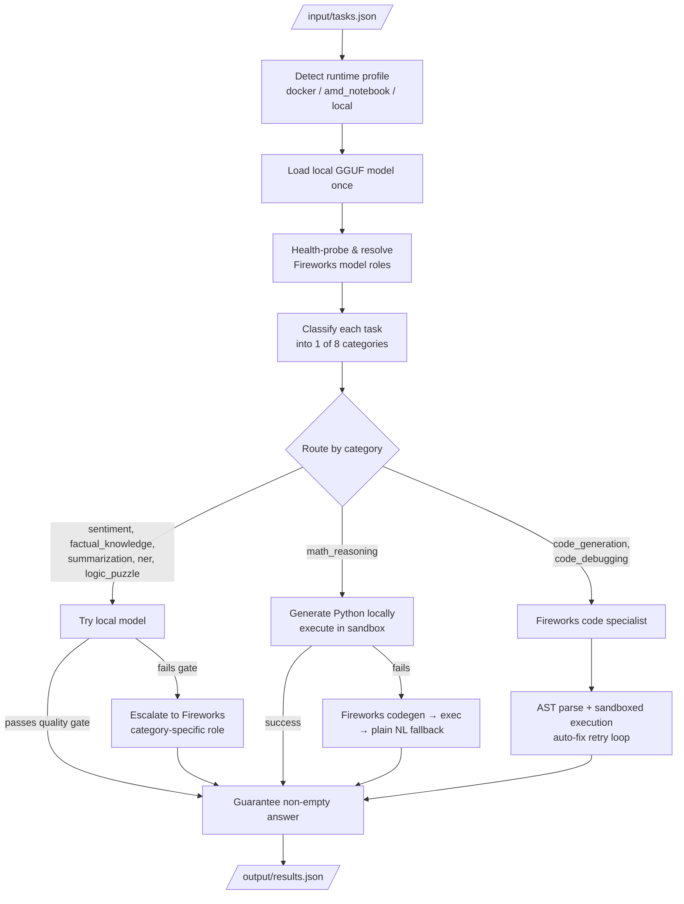

# Track 1 Agent — Cost-Aware Hybrid Routing

A Dockerized AI agent for the AMD Developer Hackathon's Track 1 challenge: read a fixed list of tasks, answer all 8 task categories correctly, and spend as few Fireworks API tokens as possible while doing it.

The container starts once, answers every task, writes its results, and exits — no human in the loop, no retries. Scoring is two-stage: clear an 80% LLM-judged accuracy gate first, then rank by **ascending Fireworks token usage** among everyone who passes. Local inference is free and unlimited; only Fireworks API calls cost anything. That asymmetry is the whole design brief: **a correct answer produced locally is strictly better than the same correct answer bought from a paid API call.**

## How it works

Every task is classified into one of 8 categories, then routed by what a small local model can plausibly handle well on its own versus what genuinely needs a larger remote model:

- **Local-first, verified escalation** (factual knowledge, sentiment, summarization, NER, logic puzzles): try the bundled local GGUF model, run its answer through a category-specific quality gate — not just "is it non-empty," but "does this actually look right" — and only escalate to Fireworks if it fails that gate.
- **Math reasoning**: solved by generating a short Python script and actually *executing* it locally, zero tokens spent, before ever falling back to a Fireworks-generated script or a plain natural-language answer.
- **Code generation / debugging**: always goes to a Fireworks code-specialist model (a small local model isn't reliable enough here), but the output is never trusted blindly — it's AST-parsed and actually executed in a sandbox, with an automatic fix-and-retry loop before being accepted.

Every path funnels through a final guarantee: no task is ever allowed to come back with an empty answer, since a missing answer for even one task lowers overall accuracy under the competition's grading rules.

## Pipeline



*Local-only paths spend zero Fireworks tokens. Every escalation is a deliberate, gated decision, never a default.*

## Repository layout

```
main.py                        Entrypoint: load tasks → classify → dispatch → write results
config.py                      Every tunable number: timeouts, token budgets, Fireworks role tables
categories/
  task_categories.py           The 8 category names — single source of truth
  classifier.py                Regex scoring + local-model tie-break for ambiguous prompts
  prompts.py                   Every literal prompt string, keyed by category
  normalizer.py                Prompt cleanup + mechanical summarization constraints
  routing.py                   Resolves each Fireworks "role" to a live, health-checked model
  local_model.py                Local GGUF singleton (sentiment/factual/summarization/ner/logic/math)
  code_exec.py / code_verifier.py   Sandboxed execution, AST verification, auto-fix retries
  prompt_compressor.py         Pure-Python long-prompt compression (no ML dependency)
  metrics.py                   Per-task latency/token logging + run summary
  executor.py                  Runtime-profile detection (worker counts, llama.cpp settings)
  handlers/                    One module per category + shared local-first/escalation helpers
utils/fireworks_client.py      OpenAI-compatible Fireworks client wrapper
tests/                         pytest unit suite + a golden end-to-end smoke test (fake client)
setup_local_models.py          One-time GGUF model downloader (run before docker build)
Dockerfile                     linux/amd64 image: local model + compiled llama-cpp-python
```

See **[ARCHITECTURE.md](ARCHITECTURE.md)** for the full technical deep dive (module-by-module responsibilities, the exact routing table, and the reasoning behind each category's verification strategy).

## Quick start

```bash
# 1. Install dependencies
pip install -r requirements.txt

# 2. Download the local GGUF models (one-time, ~2-3GB)
python setup_local_models.py

# 3. Configure credentials (never commit .env)
cp .env.example .env
# edit .env with your own FIREWORKS_API_KEY / FIREWORKS_BASE_URL / ALLOWED_MODELS

# 4. Run locally against input/tasks.json
export $(grep -v '^#' .env | xargs)
python main.py
```

## Docker

```bash
docker build --platform linux/amd64 -t <your-namespace>/<image>:<tag> .
docker images <your-namespace>/<image>:<tag>   # confirm it's under the 10GB competition cap
docker push <your-namespace>/<image>:<tag>
```

`FIREWORKS_API_KEY`, `FIREWORKS_BASE_URL`, and `ALLOWED_MODELS` are injected by the grading harness at evaluation time — they are never hardcoded or baked into the image.

## Testing

```bash
pytest                          # unit tests + golden end-to-end smoke test (no API calls, no cost)
python tests/run_fireworks_pipeline.py   # real-API smoke run against input/tasks.json (spends tokens)
```

## Competition constraints this design targets

- **80% LLM-judged accuracy gate**, then ranked by ascending Fireworks tokens among everyone who passes.
- **Local models are free and count fully toward accuracy** — the core incentive behind local-first routing.
- **Eval environment**: ~4GB RAM, 2 vCPU, no GPU — local model choice and thread counts are tuned to this.
- **Hard runtime limits**: ≤60s startup, ≤10min total, ≤30s per request — enforced via `config.TOTAL_TIME_BUDGET_S` and per-category timeouts.
- **Image size ≤10GB**, `linux/amd64`, public registry.

